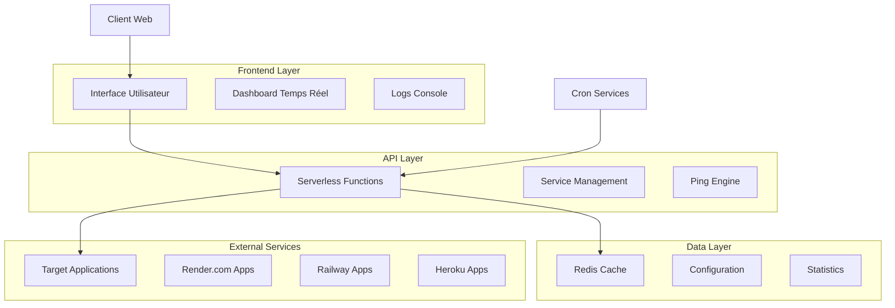
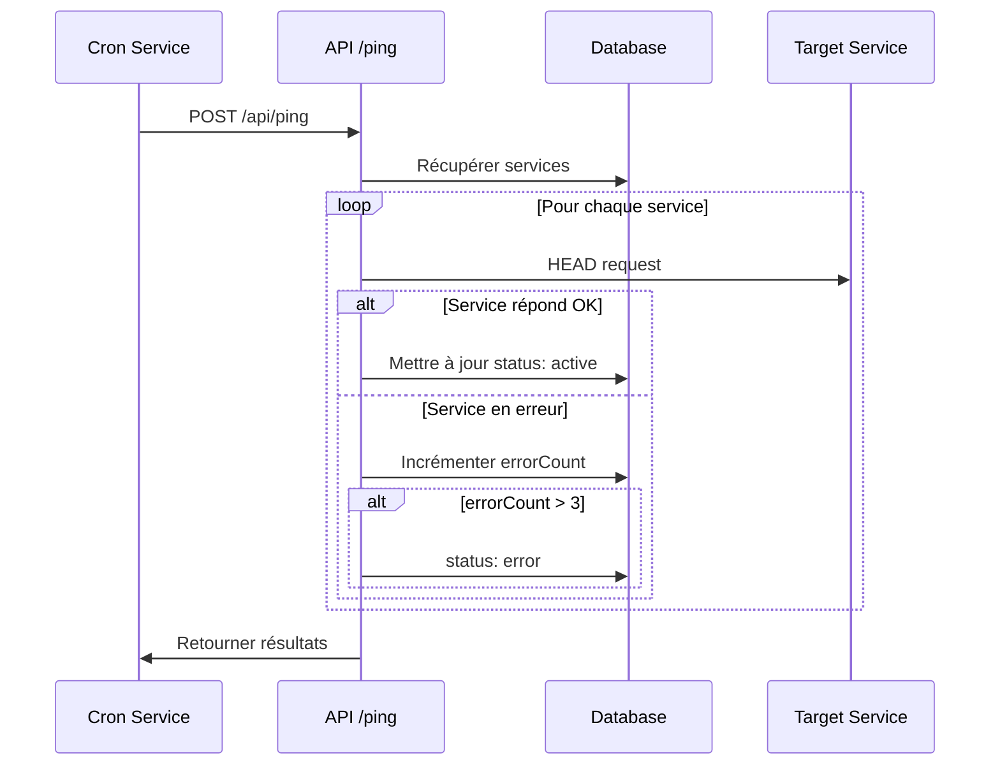

# 🚀 Keep-Alive Service - Ping Monitoring Platform


> **Solution professionnelle de monitoring et keep-alive pour maintenir vos services web actifs 24/7**

Plateforme web complète qui automatise le ping périodique de vos services hébergés sur Render.com, Railway, Heroku et autres plateformes pour éviter leur mise en veille automatique. Interface moderne avec dashboard temps réel, APIs robustes et déploiement serverless sur Vercel.

## 📋 Table des Matières

- [🎯 Problématique Résolue](#-problématique-résolue)
- [⚡ Fonctionnalités Principales](#-fonctionnalités-principales)
- [🏗️ Architecture Technique](#️-architecture-technique)
- [🛠️ Technologies Utilisées](#️-technologies-utilisées)
- [🚀 Installation Rapide](#-installation-rapide)
- [📋 Guide d'Utilisation](#-guide-dutilisation)
- [🔧 Configuration Avancée](#-configuration-avancée)
- [📊 Interface Utilisateur](#-interface-utilisateur)
- [🌐 API Documentation](#-api-documentation)
- [⚙️ Déploiement Production](#️-déploiement-production)
- [📈 Monitoring et Analytics](#-monitoring-et-analytics)
- [🧪 Tests et Qualité](#-tests-et-qualité)
- [🤝 Contribution](#-contribution)
- [📄 Licence](#-licence)

## 🎯 Problématique Résolue

### **Le Défi des Plateformes Cloud**

De nombreuses plateformes d'hébergement gratuit mettent automatiquement en veille les applications inactives :

| Plateforme | Temps d'inactivité | Impact |
|------------|-------------------|---------|
| **Render.com** | 15 minutes | ❌ Service indisponible |
| **Railway** | 5 minutes | ❌ Cold start lent |
| **Heroku** | 30 minutes | ❌ Latence accrue |
| **Fly.io** | Variable | ❌ Arrêt automatique |

### **Notre Solution**

✅ **Pings automatisés** pour maintenir l'activité  
✅ **Monitoring temps réel** avec dashboard intuitif  
✅ **Infrastructure serverless** sans maintenance  
✅ **Alertes intelligentes** en cas de panne  
✅ **Déploiement simple** en une commande  

## ⚡ Fonctionnalités Principales

### **🔄 Monitoring Automatisé**

```javascript
// Configuration flexible des intervalles
const services = [
  {
    name: "API Backend",
    url: "https://mon-api.render.com",
    interval: 10, // minutes
    method: "HEAD" // Optimisé pour la bande passante
  }
];
```

- **Pings périodiques** - Intervalles configurables (1-60 minutes)
- **Détection intelligente** - Identification automatique des pannes
- **Retry logique** - Tentatives multiples avec backoff exponentiel
- **Health checks** - Vérification de l'état des services

### **📊 Dashboard Temps Réel**

- **Statistiques live** - Services actifs, pings envoyés, taux de succès
- **Logs détaillés** - Historique complet avec timestamps
- **Indicateurs visuels** - Statuts colorés et animations
- **Interface responsive** - Compatible mobile et desktop

### **🔔 Système d'Alertes**

- **Détection de pannes** - Alertes automatiques après 3 échecs
- **Récupération de service** - Notifications de retour en ligne
- **Seuils personnalisables** - Configuration des limites d'alerte
- **Historique des incidents** - Suivi des temps d'arrêt

### **🛡️ Sécurité et Fiabilité**

- **Rate limiting** - Protection contre les abus
- **Timeout intelligent** - Gestion des requêtes longues
- **Persistance des données** - Sauvegarde avec Vercel KV
- **Haute disponibilité** - Infrastructure serverless auto-scalable

## 🏗️ Architecture Technique

### **Vue d'Ensemble du Système**



### **Architecture des Données**

```typescript
// Structure des données optimisée
interface Service {
  id: number;
  name: string;
  url: string;
  interval: number;
  status: 'active' | 'warning' | 'error';
  lastPing: string;
  errorCount: number;
  created: string;
  responseTime?: number;
}

interface Statistics {
  totalPings: number;
  successfulPings: number;
  failureRate: number;
  averageResponseTime: number;
  uptime: number;
}
```

### **Flow de Ping Automatisé**



## 🛠️ Technologies Utilisées

### **Stack Frontend**
- **HTML5** - Interface utilisateur moderne
- **CSS3** - Design responsive avec animations
- **JavaScript ES6+** - Logique client interactive
- **Fetch API** - Requêtes asynchrones optimisées

### **Stack Backend**
- **Vercel Functions** - Serverless computing
- **Node.js** - Runtime JavaScript
- **Vercel KV** - Base de données Redis managed
- **RESTful API** - Architecture API standard

### **DevOps et Monitoring**
- **Vercel Platform** - Hébergement et déploiement
- **GitHub Actions** - CI/CD automatisé
- **Cron-job.org** - Planification externe
- **Uptime Robot** - Monitoring de backup

### **Outils de Développement**
```json
{
  "dependencies": {
    "@vercel/kv": "^0.2.1",
    "node-cron": "^3.0.2"
  },
  "devDependencies": {
    "vercel": "^48.0.3",
    "prettier": "^3.0.0",
    "eslint": "^8.0.0"
  }
}
```

## 🚀 Installation Rapide

### **Méthode 1 : Déploiement Direct (Recommandée)**

[](https://vercel.com/new/clone?repository-url=https://github.com/Delmat237/keep-alive)

1. **Cliquer** sur le bouton "Deploy with Vercel"
2. **Configurer** Vercel KV database
3. **Déployer** automatiquement
4. **Configurer** le cron externe

### **Méthode 2 : Installation Locale**

```bash
# 1. Cloner le repository
git clone https://github.com/Delmat237/keep-alive.git
cd keep-alive

# 2. Installer les dépendances
npm install

# 3. Configurer l'environnement
cp .env.example .env.local

# 4. Développement local
npm run dev

# 5. Déploiement production
npm run deploy
```

### **Structure du Projet**

```
keep-alive/
├── 📁 public/                 # Interface utilisateur
│   ├── index.html            # Page principale
│   ├── styles.css            # Styles CSS
│   └── app.js               # Logique JavaScript
├── 📁 api/                    # API Serverless
│   ├── services.js           # CRUD services
│   ├── ping.js              # Moteur de ping
│   └── stats.js             # Statistiques
├── 📁 docs/                   # Documentation
├── 📁 tests/                  # Tests unitaires
├── package.json              # Configuration npm
├── vercel.json               # Configuration Vercel
└── README.md                 # Documentation
```

## 📋 Guide d'Utilisation

### **Première Configuration**

#### **1. Accéder à l'Interface**
```
https://keep-alive.vercel.app
```

#### **2. Ajouter un Service**

```javascript
// Exemple de configuration
{
  name: "Mon API Backend",
  url: "https://mon-app.render.com/health",
  interval: 10 // Ping toutes les 10 minutes
}
```

#### **3. Configurer l'Automatisation**

**Option A : Cron-job.org (Gratuit)**
```
URL: https://your-app.vercel.app/api/ping
Method: POST
Schedule: */10 * * * * (toutes les 10 minutes)
```

**Option B : GitHub Actions**
```yaml
name: Keep Services Alive
on:
  schedule:
    - cron: '*/10 * * * *'
jobs:
  ping:
    runs-on: ubuntu-latest
    steps:
      - run: curl -X POST https://your-app.vercel.app/api/ping
```

### **Utilisation Quotidienne**

#### **Dashboard Principal**
- 📊 **Statistiques** - Voir le nombre de services et le taux de succès
- 🔄 **Ping Manuel** - Tester tous les services immédiatement
- 📝 **Logs** - Suivre l'activité en temps réel
- ⚙️ **Gestion** - Ajouter/supprimer des services

#### **Monitoring des Services**
```javascript
// États des services
✅ Active    - Service répond correctement
⚠️  Warning  - 1-3 erreurs récentes
❌ Error     - Plus de 3 erreurs consécutives
```

## 🔧 Configuration Avancée

### **Variables d'Environnement**

```bash
# .env.local
NEXT_PUBLIC_APP_NAME="Keep-Alive Service"
PING_TIMEOUT=30000
MAX_RETRIES=3
RATE_LIMIT=100
LOG_LEVEL=info
```

### **Configuration Vercel KV**

```bash
# Créer la base de données
npx vercel kv create keep-alive-db

# Variables automatiquement configurées :
# KV_REST_API_URL
# KV_REST_API_TOKEN
```

### **Personnalisation du Ping Engine**

```javascript
// api/ping.js - Configuration avancée
const PING_CONFIG = {
  timeout: 30000,
  userAgent: 'KeepAlive-Service/1.0',
  retries: 3,
  retryDelay: 1000,
  headers: {
    'Accept': 'text/html,application/json',
    'Cache-Control': 'no-cache'
  }
};
```

### **Rate Limiting et Sécurité**

```javascript
// Protection contre les abus
const rateLimiter = {
  windowMs: 15 * 60 * 1000, // 15 minutes
  max: 100, // Limite de 100 requêtes
  message: 'Trop de requêtes, réessayez plus tard'
};
```

## 📊 Interface Utilisateur

### **Design System**

#### **Palette de Couleurs**
```css
:root {
  --primary: #667eea;
  --secondary: #764ba2;
  --success: #28a745;
  --warning: #ffc107;
  --danger: #dc3545;
  --light: #f8f9fa;
  --dark: #343a40;
}
```

#### **Composants Principaux**

**1. Header avec Statistiques**
```html
<!-- Dashboard cards responsive -->
<div class="stats-grid">
  <div class="stat-card">
    <div class="stat-number">12</div>
    <div class="stat-label">Services Actifs</div>
  </div>
</div>
```

**2. Formulaire d'Ajout**
```html
<!-- Form avec validation -->
<form class="service-form">
  <input type="text" placeholder="Nom du service" required>
  <input type="url" placeholder="https://..." required>
  <input type="number" min="1" max="60" placeholder="10" required>
</form>
```

**3. Liste des Services**
```html
<!-- Service cards avec statut visuel -->
<div class="service-item">
  <div class="service-info">
    <h3>Mon API</h3>
    <p>https://mon-api.render.com</p>
  </div>
  <div class="service-status">
    <span class="status-indicator active"></span>
    <button class="btn-danger">Supprimer</button>
  </div>
</div>
```

### **Responsive Design**

```css
/* Mobile First Approach */
@media (max-width: 768px) {
  .stats-grid { grid-template-columns: 1fr; }
  .service-item { flex-direction: column; }
  .container { padding: 15px; }
}

@media (min-width: 769px) {
  .stats-grid { grid-template-columns: repeat(3, 1fr); }
  .service-item { flex-direction: row; }
}
```

## 🌐 API Documentation

### **Endpoints Disponibles**

#### **GET /api/services**
Récupère tous les services configurés.

```json
{
  "success": true,
  "data": [
    {
      "id": 1625097600000,
      "name": "Mon API Backend",
      "url": "https://mon-api.render.com",
      "interval": 10,
      "status": "active",
      "lastPing": "2024-01-15T10:30:00Z",
      "errorCount": 0,
      "responseTime": 234
    }
  ]
}
```

#### **POST /api/services**
Ajoute un nouveau service à surveiller.

```json
// Request
{
  "name": "Nouvelle API",
  "url": "https://nouvelle-api.com",
  "interval": 15
}

// Response
{
  "success": true,
  "data": {
    "id": 1625097600001,
    "name": "Nouvelle API",
    "url": "https://nouvelle-api.com",
    "interval": 15,
    "status": "active",
    "created": "2024-01-15T10:35:00Z"
  }
}
```

#### **DELETE /api/services?id={id}**
Supprime un service de la surveillance.

```json
// Response
{
  "success": true,
  "message": "Service supprimé avec succès"
}
```

#### **POST /api/ping**
Lance un ping manuel de tous les services.

```json
// Response
{
  "success": true,
  "timestamp": "2024-01-15T10:40:00Z",
  "results": [
    {
      "service": "Mon API Backend",
      "status": "success",
      "responseCode": 200,
      "responseTime": 156
    }
  ],
  "stats": {
    "totalPings": 1547,
    "successfulPings": 1498,
    "failureRate": 3.2
  }
}
```

### **Codes d'Erreur**

| Code | Description | Solution |
|------|------------|----------|
| 400 | Requête invalide | Vérifier les paramètres |
| 404 | Service non trouvé | Vérifier l'ID du service |
| 429 | Rate limit dépassé | Attendre avant de réessayer |
| 500 | Erreur serveur | Contacter le support |

## ⚙️ Déploiement Production

### **Étape 1 : Préparation**

```bash
# Vérifications pré-déploiement
npm run lint
npm run test
npm run build
```

### **Étape 2 : Configuration Vercel**

```json
// vercel.json
{
  "version": 2,
  "builds": [
    { "src": "public/**", "use": "@vercel/static" },
    { "src": "api/**/*.js", "use": "@vercel/node" }
  ],
  "routes": [
    { "src": "/api/(.*)", "dest": "/api/$1" },
    { "src": "/(.*)", "dest": "/public/$1" }
  ],
  "functions": {
    "api/ping.js": { "maxDuration": 300 }
  },
  "env": {
    "NODE_ENV": "production"
  }
}
```

### **Étape 3 : Base de Données**

```bash
# Créer et configurer Vercel KV
vercel kv create keep-alive-production
vercel env add KV_REST_API_URL
vercel env add KV_REST_API_TOKEN
```

### **Étape 4 : Déploiement**

```bash
# Déploiement production
vercel --prod

# Vérification du déploiement
curl -f https://your-domain.vercel.app/api/services
```

### **Étape 5 : Configuration Cron**

**Cron-job.org Setup :**
1. Créer un compte sur [cron-job.org](https://cron-job.org)
2. Ajouter un nouveau cron job :
   - URL: `https://your-domain.vercel.app/api/ping`
   - Schedule: `*/10 * * * *`
   - Method: POST

## 📈 Monitoring et Analytics

### **Métriques Clés**

```typescript
interface Metrics {
  // Performance
  averageResponseTime: number;
  uptime: number;
  availability: number;
  
  // Utilisation
  totalServices: number;
  activePings: number;
  dailyPings: number;
  
  // Fiabilité
  successRate: number;
  errorRate: number;
  incidentCount: number;
}
```

### **Dashboard Vercel**

- **Function Logs** - Voir les logs des APIs en temps réel
- **Performance** - Temps de réponse et utilisation
- **Errors** - Suivi des erreurs et stack traces
- **Analytics** - Statistiques d'usage et trafic

### **Alertes Personnalisées**

```javascript
// Configuration des alertes
const alertRules = {
  serviceDown: {
    condition: 'errorCount > 3',
    action: 'sendNotification',
    cooldown: '15m'
  },
  highLatency: {
    condition: 'responseTime > 5000',
    action: 'logWarning',
    threshold: 3
  }
};
```

### **Rapports Automatiques**

```javascript
// Génération de rapports hebdomadaires
const generateWeeklyReport = async () => {
  const stats = await getWeeklyStats();
  return {
    summary: `${stats.totalPings} pings envoyés`,
    uptime: `${stats.uptime}% de disponibilité`,
    incidents: stats.incidentCount,
    topServices: stats.mostActiveServices
  };
};
```

## 🧪 Tests et Qualité

### **Suite de Tests**

```bash
# Tests unitaires
npm run test:unit

# Tests d'intégration
npm run test:integration

# Tests end-to-end
npm run test:e2e

# Couverture de code
npm run test:coverage
```

### **Tests API**

```javascript
// tests/api.test.js
describe('Services API', () => {
  test('should create new service', async () => {
    const response = await fetch('/api/services', {
      method: 'POST',
      body: JSON.stringify({
        name: 'Test Service',
        url: 'https://httpbin.org/status/200',
        interval: 5
      })
    });
    
    expect(response.status).toBe(200);
    const data = await response.json();
    expect(data.success).toBe(true);
  });
});
```

### **Tests de Charge**

```javascript
// tests/load.test.js
const loadTest = async () => {
  const concurrentPings = 50;
  const promises = Array(concurrentPings).fill().map(() => 
    fetch('/api/ping', { method: 'POST' })
  );
  
  const results = await Promise.allSettled(promises);
  const successCount = results.filter(r => r.status === 'fulfilled').length;
  
  console.log(`${successCount}/${concurrentPings} pings réussis`);
};
```

### **Qualité du Code**

```json
// .eslintrc.json
{
  "extends": ["eslint:recommended", "prettier"],
  "rules": {
    "no-console": "warn",
    "no-unused-vars": "error",
    "prefer-const": "error"
  }
}
```

## 🤝 Contribution

### **Comment Contribuer**

1. **🍴 Fork** le repository
2. **🌟 Créer** une branche feature
   ```bash
   git checkout -b feature/nouvelle-fonctionnalite
   ```
3. **✅ Développer** avec tests
4. **📝 Commiter** avec messages clairs
   ```bash
   git commit -m "feat: ajouter support webhooks"
   ```
5. **🚀 Push** et créer une PR
   ```bash
   git push origin feature/nouvelle-fonctionnalite
   ```

### **Standards de Code**

```javascript
// Utilisez JSDoc pour la documentation
/**
 * Ping un service et retourne le résultat
 * @param {Object} service - Configuration du service
 * @param {string} service.url - URL du service
 * @param {number} service.timeout - Timeout en ms
 * @returns {Promise<PingResult>} Résultat du ping
 */
async function pingService(service) {
  // Implementation...
}
```

### **Types de Contributions**

- 🐛 **Bug fixes** - Corrections de bugs
- ✨ **Features** - Nouvelles fonctionnalités
- 📚 **Documentation** - Améliorations doc
- 🎨 **UI/UX** - Améliorations interface
- ⚡ **Performance** - Optimisations
- 🧪 **Tests** - Amélioration couverture

### **Roadmap 2024**

#### **Q1 2024**
- [ ] Webhooks pour notifications externes
- [ ] Support multi-utilisateurs avec auth
- [ ] Graphiques de performance historique
- [ ] Export des données CSV/JSON

#### **Q2 2024**
- [ ] Mobile app (React Native)
- [ ] Intégration Slack/Discord
- [ ] Templates de services pré-configurés
- [ ] API rate limiting avancé

#### **Q3 2024**
- [ ] Machine learning pour prédiction pannes
- [ ] Monitoring géographique multi-région
- [ ] Clustering de services
- [ ] Tableau de bord administrateur

## 📄 Licence

Ce projet est sous licence **MIT** - voir le fichier [LICENSE](LICENSE) pour plus de détails.

```
MIT License

Copyright (c) 2024 Keep-Alive Service Contributors

Permission is hereby granted, free of charge, to any person obtaining a copy
of this software and associated documentation files (the "Software"), to deal
in the Software without restriction, including without limitation the rights
to use, copy, modify, merge, publish, distribute, sublicense, and/or sell
copies of the Software...
```

---

## 👨‍💻 Auteur et Équipe

### **Développeur Principal**

**Votre Nom**
- 🌐 **GitHub** : [@votre-username](https://github.com/votre-username)
- 💼 **LinkedIn** : [votre-profil](https://linkedin.com/in/votre-profil)
- 📧 **Email** : votre-email@example.com
- 🐦 **Twitter** : [@votre-handle](https://twitter.com/votre-handle)

### **Stack d'Expertise**
- **Frontend** : HTML5, CSS3, JavaScript ES6+, React
- **Backend** : Node.js, Serverless, REST APIs
- **Cloud** : Vercel, AWS, Google Cloud
- **Databases** : Redis, MongoDB, PostgreSQL
- **DevOps** : CI/CD, Docker, Monitoring

---

## 🏆 Remerciements

- **Vercel Team** - Pour la plateforme serverless exceptionnelle
- **Communauté Open Source** - Pour les outils et librairies
- **Beta Testers** - Pour les retours et suggestions
- **Contributors** - Pour les améliorations continues

---

## 📊 Métriques du Projet


---

## 🌟 Showcase

### **Services Supportés**

| Plateforme | Status | Intégration | Notes |
|------------|--------|-------------|-------|
| **Render.com** | ✅ Testé | Native | Sleep après 15min |
| **Railway** | ✅ Testé | Native | Sleep après 5min |
| **Heroku** | ✅ Testé | Native | Sleep après 30min |
| **Fly.io** | ✅ Compatible | API | Auto-stop configurable |
| **Google Cloud Run** | ✅ Compatible | HTTP | Pay-per-use |
| **AWS Lambda** | ⚠️ Partiel | API Gateway | Cold starts |

### **Cas d'Usage Réels**

```javascript
// Exemple : E-commerce API
{
  name: "Boutique API",
  url: "https://api-boutique.render.com/health",
  interval: 5, // Critique - ping fréquent
  priority: "high"
}

// Exemple : Blog Personnel
{
  name: "Blog Portfolio",
  url: "https://mon-blog.railway.app",
  interval: 30, // Non critique
  priority: "low"
}

// Exemple : Service de Notifications
{
  name: "Notification Service",
  url: "https://notifs.fly.dev/ping",
  interval: 10, // Important
  priority: "medium"
}
```

---

## 📞 Support et Contact

### **Options de Support**

- 📖 **Documentation** : [docs.keep-alive-service.com](https://docs.keep-alive-service.com)
- 🐛 **Bug Reports** : [GitHub Issues](https://github.com/votre-username/keep-alive-service/issues)
- 💬 **Discussions** : [GitHub Discussions](https://github.com/votre-username/keep-alive-service/discussions)
- 📧 **Contact Direct** : support@keep-alive-service.com

### **Temps de Réponse**

- 🔴 **Bugs critiques** : < 24h
- 🟡 **Demandes features** : < 72h  
- 🟢 **Questions générales** : < 1 semaine

---

⭐ **Si ce projet vous aide à maintenir vos services actifs, n'hésitez pas à le ⭐ starrer !**

🔗 **Partagez ce projet avec d'autres développeurs qui pourraient en bénéficier !**

📈 **Suivez-nous pour les mises à jour et nouvelles fonctionnalités !**

---

*Dernière mise à jour : Septembre 2025*